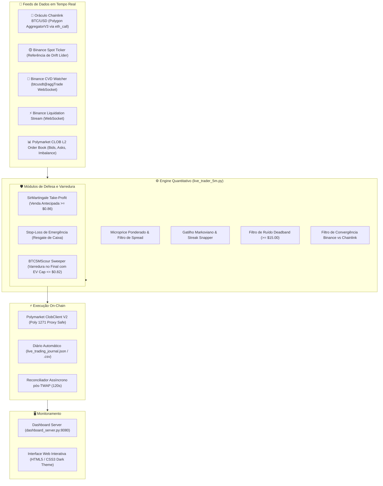

# Polymarket BTC 5M Quantitative Trading Engine 🦅🚀

Sistema autônomo de alta frequência e arbitragem estatística para os mercados binários de 5 minutos de Bitcoin no **Polymarket** via **Polygon CLOB V2 (Safe 1271)**.

---

## 🏛️ Arquitetura do Sistema



---

## 📁 Estrutura de Arquivos Principais

* **`live_trader_5m.py`**: Motor principal de negociação autônoma. Conecta com a CLOB V2, monitora o oráculo Chainlink, gerencia entradas primárias, saídas antecipadas (SirMartingale TP), stop-loss de emergência e o sweeper com travas de valor esperado positivo (EV+).
* **`dashboard_server.py`**: Servidor backend Python (porta `8080`) que expõe métricas em tempo real, KPIs de rentabilidade, saldo on-chain e histórico de ordens confirmadas na Polygon.
* **`dashboard.html` / `polymarket_dashboard.html`**: Interface do usuário com gráficos de P&L, distribuição de vitórias, tabela detalhada de trades e status do oráculo.
* **`binance_cvd_watcher.py`**: Thread autônoma consumindo o stream de agressão institucional (CVD) da Binance em milissegundos.
* **`binance_liquidation_watcher.py`**: Thread consumindo liquidações forçadas de longs/shorts na Binance para detectar exaustão de movimento.
* **`requirements.txt`**: Dependências Python para execução do projeto.
* **`.env.example`**: Template seguro de variáveis de ambiente (chaves privadas, RPCs e endereços Safe).

---

## 🛡️ Gestão de Risco e Salvaguardas

1. **Filtro de Preço Assimétrico:** Entradas primárias são restritas a cotas entre **\$0,35 e \$0,65** para garantir assimetria de retorno positiva.
2. **SirMartingale Take-Profit:** Se a cota comprada a \$0,50 valorizar para **\$0,86+**, o robô liquida a posição a mercado antes do fechamento da vela, travando lucros de **+70% a +95%** sem depender do desfecho final.
3. **Stop-Loss de Emergência:** Se o oráculo reverter fortemente contra a posição, o robô verifica o melhor bid da cota original; havendo liquidez (bid >= \$0,15), vende a posição e resgata até **\$0,62 a \$0,94** de volta, estancando a perda em centavos.
4. **Sweeper com Teto Estrito (`SCOUR_MAX_PRICE = 0.82`):** O módulo de final de vela só entra quando o retorno mínimo líquido for de pelo menos **+22% a +50%**, eliminando compras caras a \$0,95+ que oferecem risco assimétrico negativo.
5. **Reconciliador Assíncrono com a CTF Exchange:** Após o fechamento da vela, uma thread em segundo plano aguarda a consolidação do TWAP oficial de 60s da Polymarket e sincroniza o saldo exato e a liquidação dos contratos.

---

## ⚡ Instalação e Execução

### 1. Clonar e Instalar Dependências
```bash
git clone https://github.com/rafaelrogel/qwr.git
cd qwr
pip install -r requirements.txt
```

### 2. Configurar Variáveis de Ambiente
Copie o arquivo `.env.example` para `.env` e preencha suas credenciais:
```bash
cp .env.example .env
```
> ⚠️ **Aviso de Segurança:** O arquivo `.env` está explicitamente no `.gitignore` e **NUNCA** deve ser comitado no GitHub para proteger suas chaves privadas.

### 3. Iniciar o Robô e o Dashboard
Em terminais separados (ou via background tasks):

```bash
# Iniciar o servidor de monitoramento:
python dashboard_server.py

# Iniciar o robô de negociação ao vivo:
python -u live_trader_5m.py
```

Acesse o painel em seu navegador:
👉 `http://localhost:8080`

---

## 📊 Licença e Isenção de Responsabilidade

Este software foi desenvolvido para fins educacionais e de pesquisa quantitativa em mercados preditivos descentralizados. Negociação de derivativos cripto envolve risco financeiro real.
